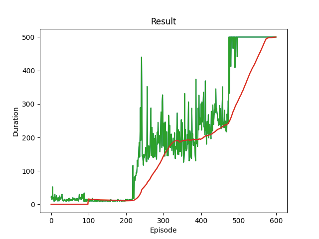
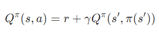
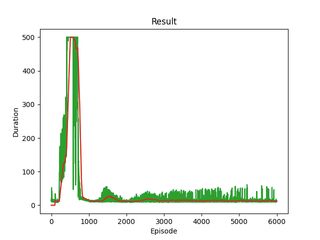

# DQN_Cartpole_v1

The code is copied from [pytorch DQN tutorial](https://pytorch.org/tutorials/intermediate/reinforcement_q_learning.html)(modified a little)

### How to run it?

```
pip install -r requirements.txt
```

Please pay attention to the version of gym(different versions of matplotlib and pytorch may be fine)

Then just run the main.py. You can use python IDE like pycharm or command line to run it.

You can change the variable Mode in main.py to decide whether to train a model yourself or test the model.

Hyperparameters(or say global variables) are all stored in params.py, you may want to change them.

```python
# main.py
from runner import train
from runner import test

ModeList=('Train','Test')
Mode=ModeList[1]
if Mode=='Train':
    train()
else:
    test(num=30, PATH='models/checkpoint600.pt')
```

### Training Process



### Results

We have reached the maximum duration possible in this version. This result seems great, isn't it?

### Issues

The problem lies in the Bellman Function



In Cartpole, the reward will always be 1, even for the action resulting in the termination of the game. So the Q* will be 1+gamma+gamma^2+... = 1/(1 - gamma) for both current state and the next state(that is, in this state, the game is supposed to continue forever, so is the next state). So the function above becomes 1/(1-gamma) = 1+ 1/(1-gamma), which will make Q* function tend to infinity.

If the training episodes become 6000:



We can find that the Duration will drop down to the bottom after about 1000 episodes of training. And I print the predictions of Q, and find that the value it outputs from smaller than 1, to near 100(600-1000 episode of training), to finally 1400 after 6000 episode of training. So my guess that the Q function will tend to infinity is verified.

I guess it's better to set the reward function to -1 for actions causing termination of the game, and 0 for other actions. When I have time, I'll try it and update the repo.
